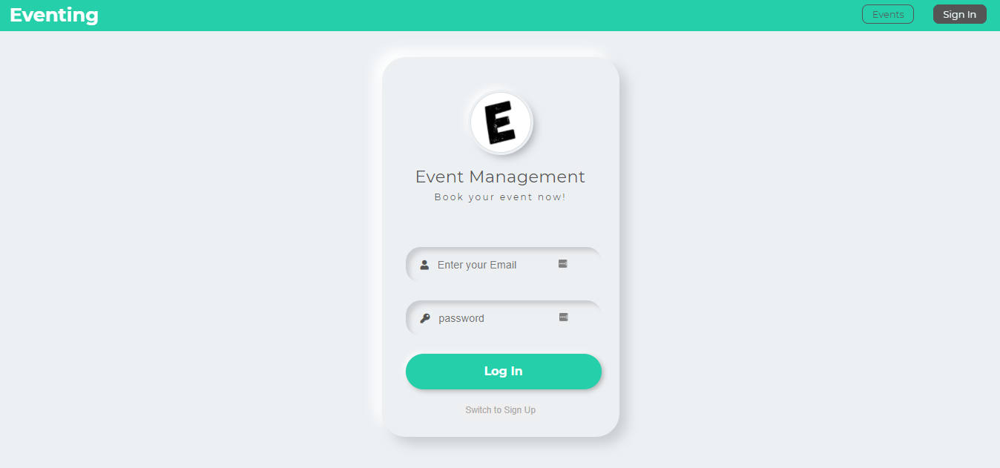

<h1>Eventing - Event Management Web Application - Client</h1>

<br />

<!-- PROJECT LOGO -->
<p  align="center">
    <a href="#">
        
    </a>
</p>

<!-- ABOUT THE PROJECT -->

## About The Project

Eventing ( Event Management Website ) is the application of project management to the creation and development of small and/or large-scale personal or corporate events such as festivals, conferences, ceremonies, weddings, formal parties, concerts, or conventions.

<!-- Screenshot -->



[Eventing (Link)](https://event-management-graphql.netlify.app/)

<!-- Built with section -->

## Built With

### Frameworks

- [React - Javascript](https://reactjs.org/)

### Add-Ons/Plugins:

- [react-toastify](https://www.npmjs.com/package/react-toastify)
- [react-router-dom](https://www.npmjs.com/package/react-router-dom)

<!-- GETTING STARTED -->
# Getting Started

This project is bootstrapped with [Create React App](https://github.com/facebook/create-react-app).

### Prerequisites

You will need a node in your system.

- npm

  ```sh
  npm install npm@latest -g
  ```

- Verify Installation
  ```sh
  node -v
  ```

### Installation

1. Clone the Front-End repo

   ```sh
   git clone https://github.com/thearpitanand/event-booking-client
   ```

2. Clone the Back-End repo

   ```sh
   git clone https://github.com/thearpitanand/event-booking-server
   ```

3. Install NPM packages

   ```sh
   yarn i
   ```

4. Create `.env` file then enter your API.

   ```sh
   REACT_APP_API="YOUR BACKEND - API LINK"
   ```

5. Run the app in the development mode.

   ```sh
   yarn start
   ```

6. Open [http://localhost:3000](http://localhost:3000) to view it in the browser.

<!-- Test Details -->

## Test Details

### User Id, Password

- ID
  ```sh
  test.user@eventing.com
  ```
- Password
  ```sh
  eventing
  ```

<!-- Disclaimer -->

## DISCLAIMER

Your suggestions are highly acknowledged. [Open issue](https://github.com/thearpitanand/event-booking-client/issues)

<!-- CONTACT -->

## Contact

Name - Arpit Anand\
Unsplash - [@thearpitanand](https://unsplash.com/@thearpitanand)\
Twitter - [the_arpitanand](https://twitter.com/the_arpitanand)\
LinkedIn - [thearpitanand](https://www.linkedin.com/in/thearpitanand/)\
Instagram - [anand_arpit](https://www.instagram.com/anand_arpit/)\
Project Link: [Front - End](https://github.com/thearpitanand/event-booking-client), [Back - End](https://github.com/thearpitanand/event-booking-server)